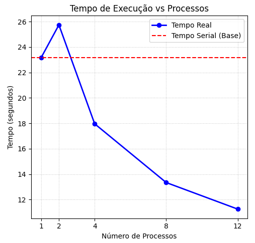
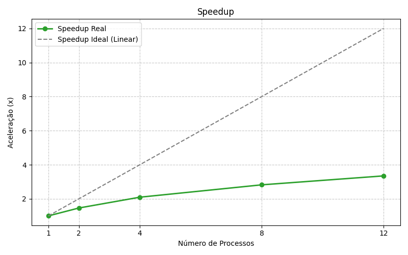
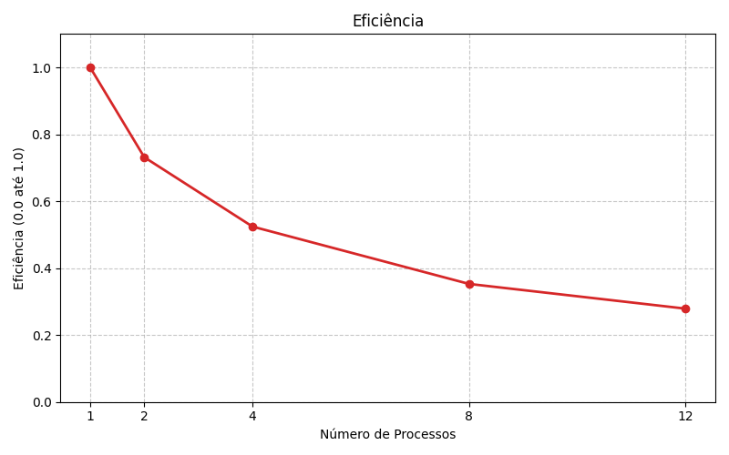

# unieuro-concorrente-202601-atividade5
* **Testar a solução MPI construindo relatório de avaliação de performance para 2, 4, 8, 12 processos.

Relatório da atividade de Programação Concorrente e Distribuída 05  
**Disciplina:** PROGRAMAÇÃO CONCORRENTE E DISTRIBUÍDA  
**Aluno(s):** Filipe Ferreira  
**Turma:** 5º semestre de ADS matutino  
**Professor:** Rafael Marconi Ramos  
**Data:** 10/04/2026

---

# 1. Descrição do Problema

O objetivo desta atividade é avaliar o desempenho de uma solução de processamento distribuído utilizando o protocolo **MPI (Message Passing Interface)** através da biblioteca `mpi4py`. O problema consiste em processar o dataset `nlp_features_train.csv` (proveniente do desafio Quora Question Pairs do Kaggle), realizando operações de leitura e análise de dados em larga escala.

* **Algoritmo utilizado:** A versão distribuída utiliza o modelo de passagem de mensagens. O processo mestre (rank 0) coordena a distribuição dos dados ou a leitura paralela, enquanto os processos escravos realizam o processamento computacional das features do dataset. A redução final consolida os resultados de todos os nós.
* **Dataset:** Arquivo `nlp_features_train.csv` (Kaggle - Quora Question Pairs).
* **Objetivo da paralelização:** Comparar a execução serial com a execução distribuída via MPI, medindo o ganho de desempenho (Speedup) e a eficiência conforme o número de processos aumenta (2, 4, 8 e 12 processos).
* **Complexidade:** A complexidade de tempo do algoritmo é $O(n)$, onde $n$ é o número de registros no dataset.

---

# 2. Ambiente Experimental

Os experimentos foram executados no seguinte ambiente:

| Item                        | Descrição |
| --------------------------- | --------- |
| Processador                 | 12th Gen Intel(R) Core(TM) i5-12500 (3.00 GHz) |
| Número de núcleos           | 6 Núcleos Físicos / 12 Threads |
| Memória RAM                 | 16,0 GB |
| Sistema Operacional         | Windows 11 Pro |
| Linguagem utilizada         | Python 3.13.2 |
| Biblioteca MPI              | `mpi4py` e Microsoft MPI (MS-MPI v10) |
| Dataset                     | nlp_features_train.csv |

---

# 3. Metodologia de Testes

Os tempos foram medidos utilizando a função `time.perf_counter()` para garantir precisão de alta resolução.

* **Execução Base (1 Processo):** `mpiexec -n 1 python avaliador_mpi.py`
* **Execução Distribuída:** `mpiexec -n 
 python avaliador_mpi.py` (onde $p$ é o número de processos).
* **Cálculo:** Foram realizadas 5 execuções para cada configuração. O tempo registrado descarta a primeira execução (*cold start*) e apresenta a média aritmética das execuções subsequentes.

---

# 4. Resultados Experimentais

Tempos médios de execução obtidos no processamento do dataset Quora:

| Nº Processos | Tempo de Execução (s) |
| ------------ | --------------------- |
| 1            | 37.66s                |
| 2            | 25.74s                |
| 4            | 17.96s                |
| 8            | 13.34s                |
| 12           | 11.25s                |

---

# 5. Cálculo de Speedup e Eficiência

As métricas de desempenho foram calculadas com base nas seguintes fórmulas:

### Speedup
$$S(p) = \frac{T(1)}{T(p)}$$

### Eficiência
$$E(p) = \frac{S(p)}{p}$$

---

# 6. Tabela de Resultados Consolidados

| Processos | Tempo (s) | Speedup ($S_p$) | Eficiência ($E_p$) |
| --------- | --------- | --------------- | ------------------ |
| 1         | 37.66s    | 1.00            | 1.00               |
| 2         | 25.74s    | 1.46            | 0.73               |
| 4         | 17.96s    | 2.10            | 0.52               |
| 8         | 13.34s    | 2.82            | 0.35               |
| 12        | 11.25s    | 3.35            | 0.28               |

---

# 7. Gráfico de Tempo de Execução

# 8. Gráfico de Speedup

# 9. Gráfico de Eficiência

---

# 10. Análise dos Resultados

A análise dos dados revela comportamentos críticos da computação distribuída em ambiente local:

1.  **Ganho de Desempenho Real (Caso de 2 Processos):** A execução com 2 processos foi consideravelmente mais rápida (**25.74s**) que a de 1 processo (**37.66s**), gerando um Speedup de **1.46x**. Isso demonstra que a divisão de carga compensa o custo inicial de comunicação e coordenação do ambiente MS-MPI.
2.  **Gargalo de I/O e Comunicação:** Embora o tempo total tenha caído para **11.25s** com 12 processos, o Speedup resultante foi de apenas **3.35x** (longe do ideal de 12x). Isso indica que o processamento do dataset do Quora não é puramente dependente de CPU; ele é fortemente limitado pela velocidade de leitura do disco e pela transferência dos dados entre os processos MPI.
3.  **Eficiência:** A eficiência caiu para **28%** com 12 processos, sugerindo que o aumento de recursos computacionais não se traduz em ganho proporcional. Isso ocorre devido à contenção de recursos compartilhados (barramento de memória e disco) e ao uso de núcleos lógicos (hyper-threading) após ultrapassar os 6 núcleos físicos do processador.

---

# 11. Conclusão

O experimento com MPI validou que a paralelização distribuída reduz significativamente o tempo de execução (de aproximadamente 37 segundos para 11 segundos), mas introduz um custo de coordenação (*overhead*) que impede uma escalabilidade linear perfeita em uma única máquina. 

Para otimizar a performance no dataset `nlp_features_train.csv`, recomenda-se que cada processo MPI realize a leitura de fatias específicas do arquivo (offset) de forma independente, minimizando a comunicação centralizada e maximizando a vazão de dados. O uso de MPI mostra-se mais vantajoso em ambientes de cluster onde a carga computacional por nó justifica o custo da rede.
